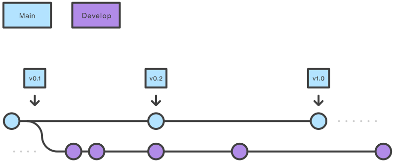

# Tutorial de Desarrollo de Odoo 16.0

#### Clase 04
### Repositorios Git

#### Agenda


**1.- Gitflow.**

```bash 

git checkout main
git checkout -b develop
git checkout -b feature_branch
# work happens on feature branch
git checkout develop
git merge feature_branch
git checkout main
git merge develop
git branch -d feature_branch


git checkout main
git checkout -b hotfix_branch
# work is done commits are added to the hotfix_branch
git checkout develop
git merge hotfix_branch
git checkout main
git merge hotfix_branch

````

#### Funcionamiento




**2.- Creación de repositorio mirror.**

- Crea un clon desnudo del repositorio. Reemplaza el nombre de usuario 
del ejemplo por el nombre de la persona u organización propietaria 
del repositorio y reemplaza el nombre del repositorio.

```bash 
git clone --bare https://github.com/EXAMPLE-USER/OLD-REPOSITORY.git 
````
- Navegar al repositorio que se acaba de clonar

```bash 
cd OLD-REPOSITORY
````
- Subir en espejo al nuevo repositorio.

```bash 
git push --mirror https://github.com/EXAMPLE-USER/NEW-REPOSITORY.git
````

- Eliminar el repositorio local temporal que se creo previamente

```bash 
cd ..
rm -rf OLD-REPOSITORY
````

**3.- Despliegue de instancia en ambiente de desarrollo.**

- Descarga de repositorios con mani
- Configuración de archivos para manejo de variables de entorno
- Configuración de python interpreter
- Configuración de aplicación para iniciar, depurar, desplegar servicio de Odoo
