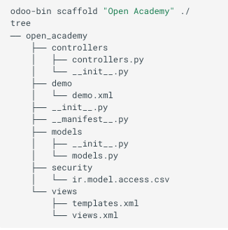

# Tutorial de Desarrollo de Odoo 16.0

#### Clase 05
### Odoo y Modelos Relacionales

#### Agenda

### Introducción

**1.- Estructura de directorios de un Modulo de Odoo**



**2.- Odoo y modelos relacionales**

- Campos Simples

    Hay dos categorías de campos 'simples' valores atomicos que se guardan directamente en las tablas y 'relacionales' que enlazan registros.

    Simples como:
        
    \* Char * Float * Integer

- Campos avanzados como 

    \* Binary * Html * Image * Monetary * Selection * Text

- Campos de Date(time)
  
   \*Date
   \*Datetime
  
- Campos Relacionales
      
    \* Many2One
    \* One2Many
    \* Many2many


- Campo Computado 

    En Odoo consiste en asociar a un campo un valor dependiendo de un cálculo.

```python
@api.depends('partner_id')
def compute_age(self):
    for rec in self:
        rec.field_compute_age = (field.Datetime.now() - rec.partner_id.birthday).year
```

### Relaciones entre modelos

Los campos relación enlazan registros, bien del mismo modelo (jerarquicos) o entre modelos

Tipos:

```python

Many2one(other_model, ondelete='set null') enlace simple a otro modelo

One2many(other_model, related_field)

Many2many(other_model)
```

### Pseudo Relaciones entre modelos

```python

Reference(string='Template', selection='_selection_template_model')  # "res_model,res_id"

Many2oneReference(model_field='res_model')  # res_id

Many2many(other_model)
```

**Ejemplo**

```python
m2o_id = fields.Many2one()
m2m_ids = fields.Many2many()
o2m_ids = fields.One2many()

# Soportado
d_ids = fields.Many2many(related="m2o_id.m2m_ids")
e_ids = fields.One2many(related="m2o_id.o2m_ids")

# No funciona: se debe utilizar un relaciónMany2many computada
f_ids = fields.Many2many(related="m2m_ids.m2m_ids")
g_ids = fields.One2many(related="o2m_ids.o2m_ids")

```


### Práctica 01

La empresa "El Porvenir SRL" nos ha contratado para realizar adecuaciones
a su sistema ERP Odoo version 16 en su formulario de contactos, con el fin de iniciar
el proceso de cambio de facturación, de computarizada a Electronica en Linea
para lo cual nos solicita como primera fase lo siguiente:

1. Adicionar el tipo de documento en el formulario de contactos
2. Adicionar la extension del documento si corresponde al tipo CI
3. Mostrar Nro de documento y extension en un solo campo si corresponde en formulario y lista
4. Que el campo nro documento se pueda buscar en un solo campo de filtro junto con el nombre, direccióny telefono
5. Que se pueda filtrar por tipo de documento en la vista de lista
6. Identificar a los contactos que son clientes y los contactos que son usuarios del sistema.
Tomar en cuenta que un usuario puede ser un cliente.
7. Asignar codigo de contacto con el siguiente formato:
   -     CLI-YEAR(2)-0000  0000 correlativo durante el año
8. Proceso para realizar actualizaciones masivas de los datos de los contactos solo para usuarios autorizados
   - Campos [etiquetas, estado, tipo_compania] 
9. Se requiere dos roles: Asistente y Supervisor
    - Asistente: Puede registrar nuevos contactos y leer sus datos. No puede modificar una vez guardados los contactos 
            y marcados como publicados
    - Supervisor: Mismas opciones que Asistente pero si puede modificar contactos
                  y solicitar la baja de un contacto al administrador del sistema.


Que comience el juego!!