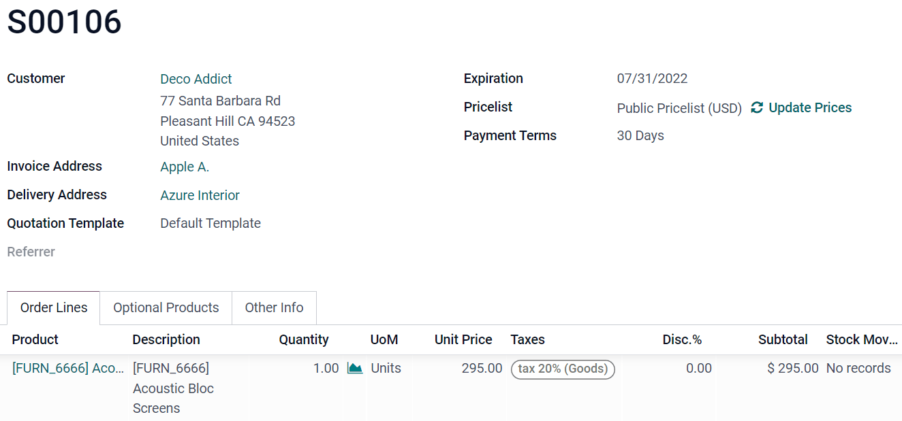
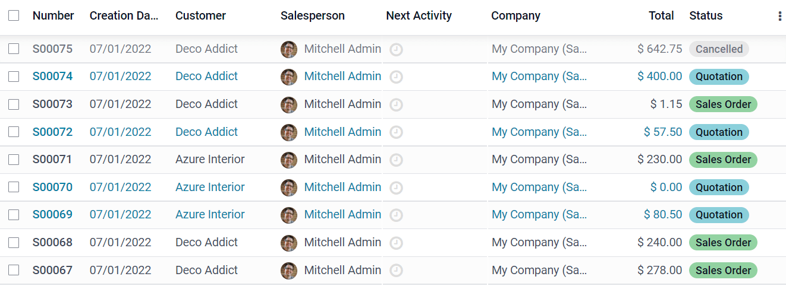
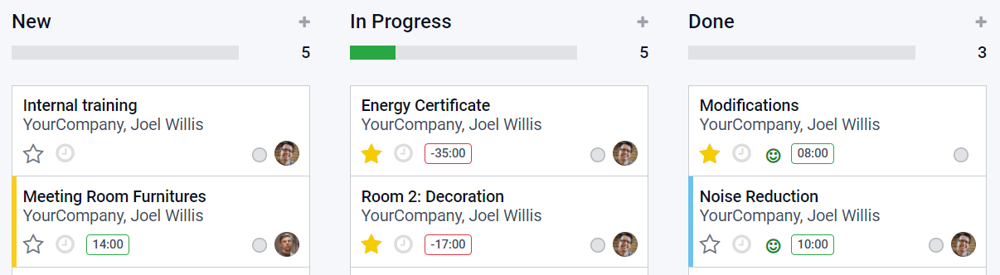
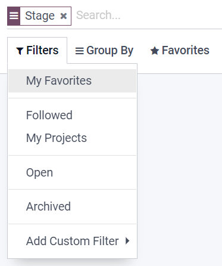

# Tutorial de Desarrollo de Odoo 16.0

#### Clase 06
### Estructura avanzada de módulos (modelos, vistas, controladores).  Creación de wizards y flujos personalizados

#### Agenda

### Introduccion

En Odoo, la estructura de un módulo avanzado suele incluir modelos, vistas y controladores. Los modelos definen la estructura de los datos, las vistas la interfaz de usuario para interactuar con esos datos, y los controladores gestionan las solicitudes web y la lógica de la aplicación.

#### 1. Modelos (Objects):

Representan la estructura de los datos en la base de datos, utilizando clases Python que se extienden de models.Model (o models.AbstractModel, models.TransientModel). 

##### Tipos de Modelos:

- **Model**: Modelos persistentes, que guardan datos en la base de datos.

- **TransientModel**: Modelos temporales, utilizados para formularios que no guardan datos permanentemente.

- **AbstractModel**: Modelos que sirven como base para otros modelos, sin ser utilizados directamente. 

#### 2. Vistas:

Definen cómo se muestra la información de los modelos en la interfaz de usuario. 

##### Tipos de Vistas:

- **tree**: Vista tabular para mostrar varios registros de un modelo. 

- **form**: Vista de formulario para editar o ver un registro específico. 

- **kanban**: Vista de tipo Kanban para visualizar tareas y flujo de trabajo. 

- **graph**: Vista de gráficos para mostrar datos estadísticos. 

- **calendar**: Vista de calendario para visualizar eventos y citas. 

**QWeb:**

Odoo utiliza el motor QWeb para la renderización de las vistas, permitiendo crear plantillas HTML dinámicas. 

#### 3. Controladores:

Gestionan las solicitudes web a la aplicación, procesando la información recibida y devolviendo una respuesta (por ejemplo, una vista HTML, un archivo JSON, etc.).

Las funciones implementan funcionalidades web en Odoo, asi como los decoradores que se utilizan para adicionar procesos a las funciones.

### Sintesis

- La estructura de un módulo Odoo es modular y jerárquica
- Los modelos gestionan la estructura de datos
- Las vistas gestionan la interfaz de usuario.
- Los controladores la logica de la aplicación y la interacción con el usuario a través de la web. 

#### 4. Continuacion Practica 01

- Integrar Tipo de Documento a Contacto
- Crear las vistas de tipo de documento
- Modificar vista de Contactos