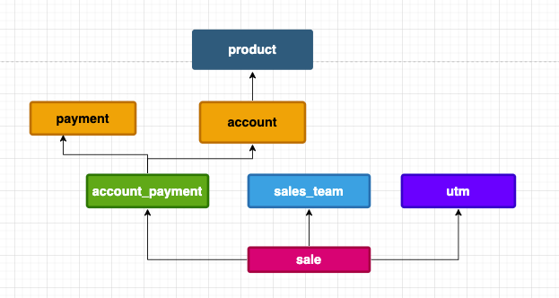
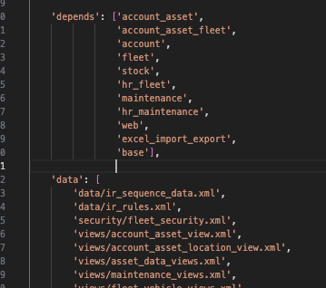

# Tutorial de Desarrollo de Odoo 16.0

#### Clase 08
### Dependencias entre módulos. Integración con módulos existentes (CRM, Ventas, Inventario)

#### Agenda

### Introducción

Las dependencias entre módulos Odoo se gestionan en el archivo manifest de cada módulo, utilizando la función depends() para especificar qué otros módulos son necesarios para el funcionamiento del módulo actual. Esta gestión asegura que los módulos se instalen correctamente y que las dependencias se resuelvan automáticamente, según Odoo. 

#### 1. Tips para manejo de dependencias adecuadamente

- El orden de las dependencias es importante
- Respetar los niveles de dependencias

