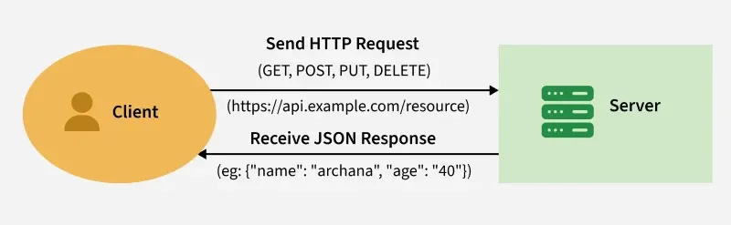

# Tutorial de Desarrollo de Odoo 16.0

#### Clase 12
### Integración avanzada con APIs externas (RESTful)

#### Agenda

### Introducción
API RESTful:
Es un tipo de API que utiliza métodos HTTP para interactuar con los recursos. No tiene estado, lo que significa que cada solicitud contiene toda la información necesaria para su procesamiento.

Las API REST utilizan métodos HTTP estándar para diferentes acciones:
- GET: Recupera datos de un recurso.
- POST: Crea un nuevo recurso.
- PUT: Actualiza un recurso completo.
- DELETE: Elimina un recurso.

### Conceptos claves

- Intercambio de datos
- Autenticacion y autorizacion

### Beneficios de usar API REST

- **Integración:** Facilita la integración con otras aplicaciones y sistemas.
- **Flexibilidad:** Permite una mayor variedad de interacciones con los datos de Odoo.
- **Accesibilidad:** Permite el acceso a los datos de Odoo en diversos dispositivos y plataformas.
- **Automatización:** Facilita la automatización de flujos de trabajo y procesos.
- **Autenticación y autorización:** La API REST de Odoo suele utilizar tokens o claves de autenticación para verificar la identidad de los usuarios o aplicaciones. Estos tokens se suelen generar utilizando credenciales codificadas en Base64.