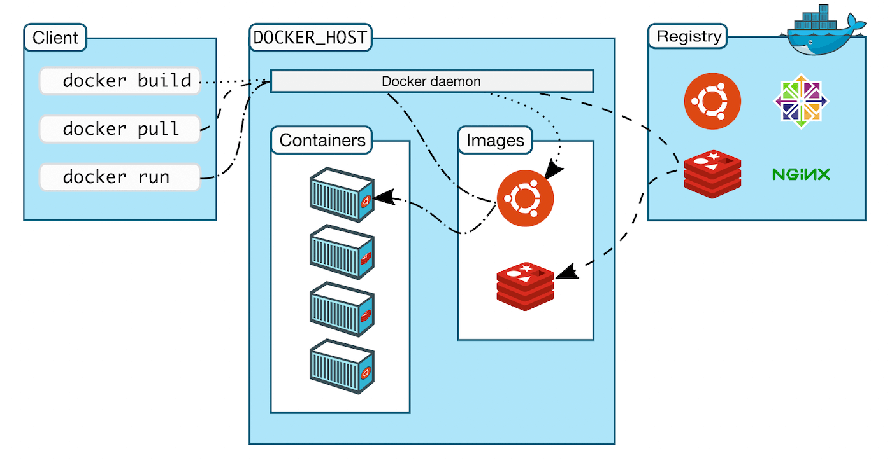

# Tutorial de Desarrollo de Odoo 16.0

#### Clase 16
### Introducción a Docker y despliegue de ambientes, Manejo de múltiples servicios con Docker Compose y Integración y testing en ambientes de desarrollo con contenedores

### Introducción

Docker es una plataforma de código abierto que permite a los desarrolladores crear, implementar, ejecutar, actualizar y administrar aplicaciones en contenedores.

#### Caracteristicas

- Docker empaqueta el software en unidades estandarizadas llamadas contenedores que tienen todo lo que el software necesita para ejecutarse, incluidas bibliotecas, herramientas del sistema, código y tiempo de ejecución.
- Los contenedores son livianos y contienen todo lo necesario para ejecutar la aplicación, por lo que no necesita depender de lo que está instalado en el host.

### Ejemplos y documentacion

[Awesome Compose](https://github.com/docker/awesome-compose)

[Awesome Compose Examples](https://www.docker.com/blog/awesome-compose-app-samples-for-project-dev-kickoff/)

[Awesome Docker](https://github.com/veggiemonk/awesome-docker)

[Awesome Docker Security](https://github.com/myugan/awesome-docker-security)

### Aplicaciones
    
[Portainer](https://hub.docker.com/r/portainer/portainer-ce)

### Docker Odoo

[Odoo Docker Oficial](https://hub.docker.com/_/odoo)

[Github Repo 1](https://github.com/minhng92/odoo-17-docker-compose)

[Github Repo 2](https://github.com/bitnami/containers/blob/main/bitnami/odoo/docker-compose.yml)

[Github Repo 3](https://github.com/iterativo-git/dockerdoo)

[Github Repo 0](https://github.com/camptocamp/docker-odoo-project/blob/master/example/docker-compose.yml)

### Ejericio

- Construir imagen odoo docker version 16 a partir de la version oficial
- Adicionar librerias complementarias
- Generar docker-compose 
- Que se pueda integrar a otros contenedores como: Postgresql, Redis, Nginx, Nginx proxy manager

### Guia

[Digital Ocean Guis](https://www.digitalocean.com/community/tutorials/how-to-install-odoo-with-docker-on-ubuntu)

